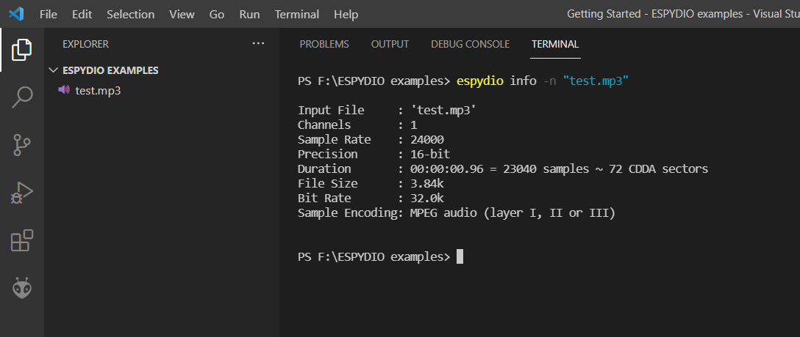
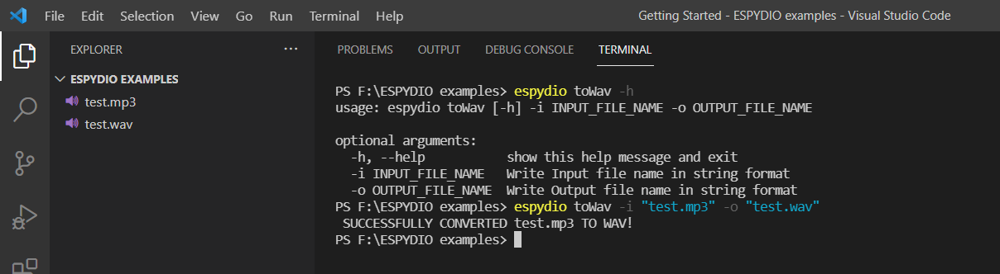
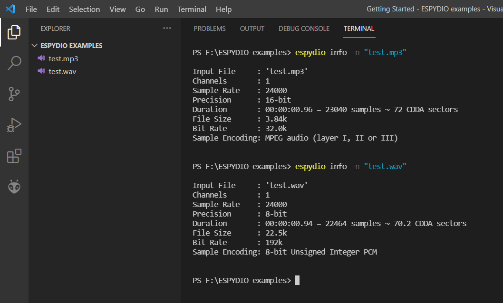
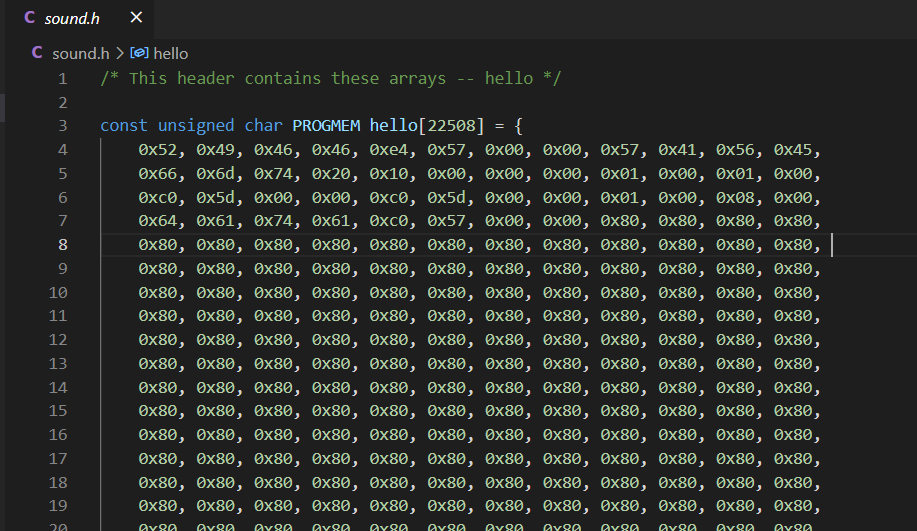
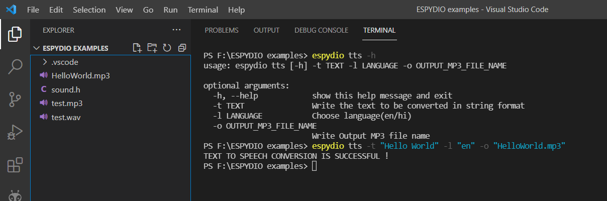

# espydio

*A command line utility built using python to automate audio file conversions, thereby assisting audio playing on ESP32 (primarily for [Tactile Tricorder](temp)).*

## Installation

- This requires that [SoX](http://sox.sourceforge.net/) version 14.4.2 or higher is installed with required handlers for MP3 files (path for excecutable file must be added to environment variables).

- To install the most up-to-date release of this module via PyPi:

    ```pip install espydio```

- To install the master branch:

    ```pip install git+https://github.com/namanPuri/espydio.git```

    or, **Simply clone the git repository and install setup.py.**

    ```shell
    git clone https://github.com/namanPuri/espydio.git
    cd espydio
    python setup.py install
    ```

## USAGE

Once ***espydio*** is installed, open any command-line tool and run :

```shell
    >espydio
```

If everything is good upto here, this must be recognised and you will get this as output.

```shell
usage: espydio [-h] {info,toWav,toHex,tts,stream,allToWav,allToHex,allToMp3,tth} ...
espydio: error: the following arguments are required: command
```

i.e.,


### espydio - List of Commands

1. [info](#info)
2. [toWav](#toWav)
3. [toHex](#toHex)
4. [tts](#tts)
5. [stream](#stream)
6. [allToWav](#allToWav)
7. [allTohex](#allToHex)
8. [allToMp3](#allToMp3)
9. [tth](#th)

To get a list of commands, in command-line tool itself with short description, you can run

```shell
>espydio -h
```


### Command Descriptions and Examples

To get the description of using a particular command you can run:

```shell
>espydio <name of command> -h
```


It will output the command usage and decription of it's required parameters.

## 1. info <a name="info"></a>

---

**Description:** This command can be used to print the details of the given audio file.

**Usage:** espydio info [-h] -n NAME_OF_FILE

**Example:**



## 2. toWav <a name="toWav"></a>

---

**Description:** This command converts the given MP3 or OGG file to WAV format with a sampling rate of 24khz and with sample encoding as 8-bit unsigned-integer PCM.

**Usage:** espydio toWav [-h] -i INPUT_FILE_NAME -o OUTPUT_FILE_NAME

**Example:**



**Comparing the details of MP3 file and converted Wav file.**



## 3. toHex <a name="toHex"></a>

---

**Description:** This command converts the given WAV file to arduino-ide supported C header file containing the hex codes of the samples stored in an array with the required type qualifier to store the array in flash memory of the controller and not in RAM.

**Usage:** espydio toHex [-h] -n WAV_FILE_NAME -a ARRAY_NAME -o HEX_FILE_NAME

**Example:**


**C header would like this.**



## 4. tts <a name="tts"></a>

---

**Description:** This command converts the given text to speech(MP3 format), with the desired language settings.

**Usage:** espydio tts [-h] -t TEXT -l LANGUAGE -o OUTPUT_MP3_FILE_NAME

**Example:**


