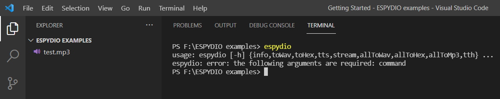

# espydio

*A command line utility built using python to automate audio file conversions, thereby assisting audio playing on ESP32 (primarily for [Tactile Tricorder](temp)).*

## Installation

- This requires that [SoX](http://sox.sourceforge.net/) version 14.4.2 or higher is installed with required handlers for MP3 files (path for excecutable file must be added to environment variables).

- To install the most up-to-date release of this module via PyPi:

    ```pip install espydio```

- To install the master branch:

    ```pip install git+https://github.com/namanPuri/espydio.git```

    or, **Simply clone the git repository and install setup.py.**

    ```shell
    git clone https://github.com/namanPuri/espydio.git
    cd pysox
    python setup.py install
    ```

## USAGE

Once ***espydio*** is installed, open any command-line tool and run :

```shell
    >espydio
```

If everything is good upto here, this must be recognised and you will get this as output.

```shell
usage: espydio [-h] {info,toWav,toHex,tts,stream,allToWav,allToHex,allToMp3,tth} ...
espydio: error: the following arguments are required: command
```
i.e.,


### espydio - List of Commands

To get a list of commands with short description, you can run

```shell
>espydio -h
```


1. [info](#info)
2. [toWav](#toWav)
3. [toHex](#toHex)
4. [tts](#tts)
5. [stream](#stream)
6. [allToWav](#allToWav)
7. [allTohex](#allToHex)
8. [allToMp3](#allToMp3)
9. [tth](#th)

### Command Descripti